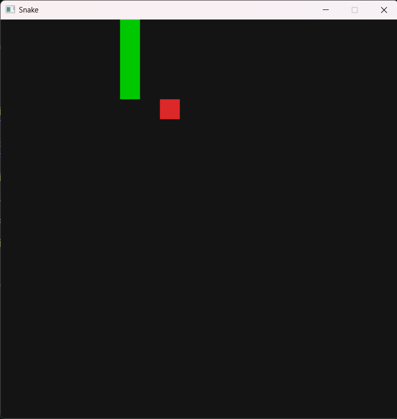
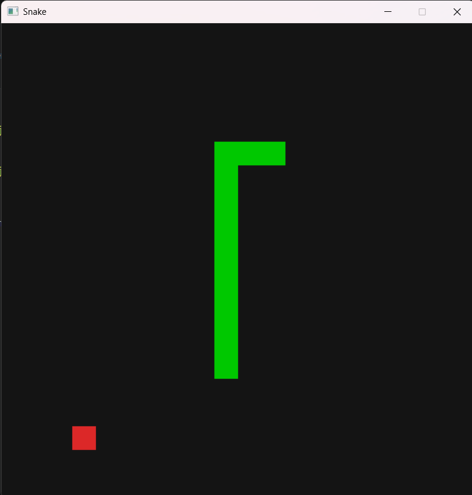
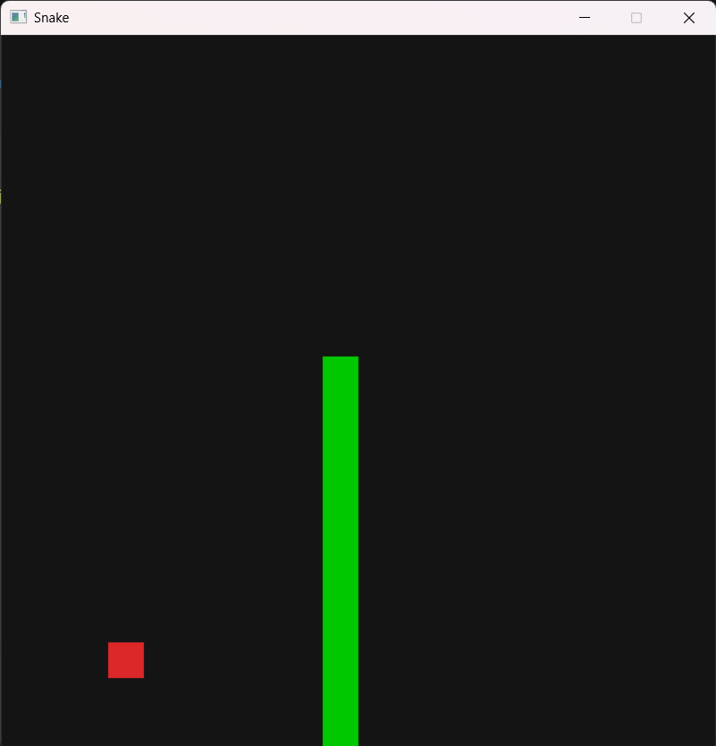

# Snake

A classic Snake game built with C# and .NET 10, rendered using Silk.NET/SDL2 with no game engine. The game features a snake that moves on a fixed grid, eats randomly spawned food, grows on each pickup, and ends on wall or self collision. Player progress is persisted to disk between sessions via JSON serialization of the top scores.

## Build & Run

```bash
dotnet build
dotnet run
```

If Windows Application Control blocks the Debug build, use Release:

```bash
dotnet build -c Release
dotnet run -c Release
```

## Controls

- **Arrow keys** — steer the snake (Up / Down / Left / Right)
- **R** — restart after game over
- **ESC** — quit

## Game Rules

Standard Snake rules. The snake moves continuously on a 20x20 grid at 150ms per cell. Eat the red food to grow by one segment and gain one point. The game ends when you crash into a wall or your own body. Top 5 high scores are saved between sessions in `highscores.json`.

## Screenshots







## AI Usage

See `AI_USAGE.md`.
